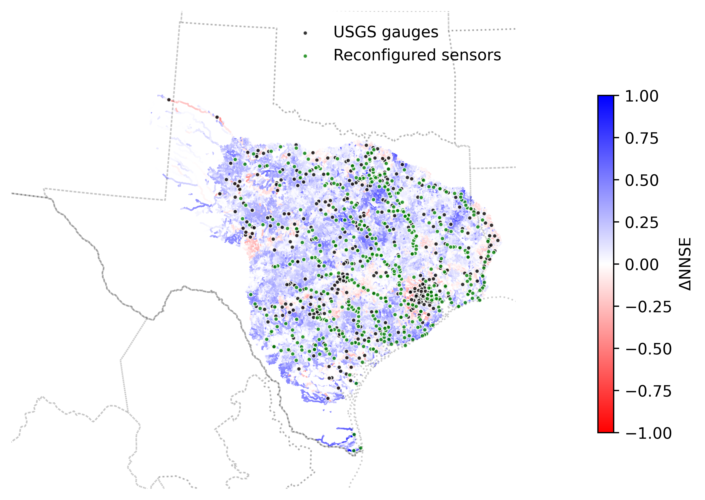

# hydrological-sensor-network-design

Oh, J., Bartos, M. Scalable, adaptive and risk-informed design of hydrological sensor networks. Nat Water (2025). https://doi.org/10.1038/s44221-025-00496-7

## Features

- **Sensor Network Reconfiguration**: Optimize sensor locations using QR decomposition to improve monitoring coverage
- **Network Expansion Planning**: Plan strategic sensor network expansion from existing network
- **Flood Risk Analysis**: Incorporate flood risk data into sensor placement decisions
- **Global Application**: A nationwide gage network design applied to Bangladesh and Brazil

## Data Sources
- Daily Streamflow Data: [Download](https://10-157-18-30.future-water.direct.quickconnect.to:5001/sharing/EOgiwkNUm)
- Flowline Shapefile Data: [Download](https://10-157-18-30.future-water.direct.quickconnect.to:5001/sharing/hAM9mX9om)
- FEMA Flood Risk Data: [Download](https://hazards.fema.gov/nri/Content/StaticDocuments/DataDownload//NRI_GDB_CensusTracts/NRI_GDB_CensusTracts.zip)
- GloFAS streamflow data: [Download](https://10-157-18-30.future-water.direct.quickconnect.to:5001/sharing/gJj5nUtap)
- NHDPlus variables: [Download](https://10-157-18-30.future-water.direct.quickconnect.to:5001/sharing/hL2QHR49y)
